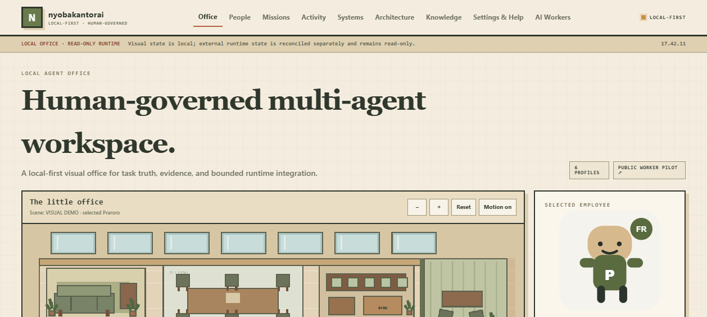
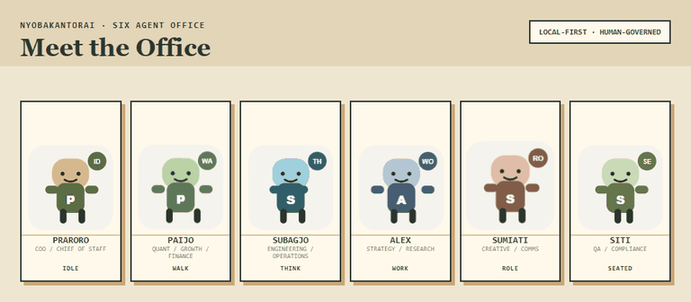

# nyobakantorai

> **Catatan buat gue sendiri.**
>
> Iki kantor AI.
>
> Tapi kalau suatu hari isinya cuma avatar jalan-jalan, status "working", terus nggak ada bukti kerja apa pun:
>
> **berarti gue bikin The Sims, bukan agent system.**

<p align="center">
  
</p>

## Ngene loh.

Gue pengen punya **kantor AI lokal**.

Bukan satu chatbot yang disuruh jadi semuanya.

Tapi beberapa role yang jelas:

- ada yang koordinasi;
- ada yang mikir angka;
- ada yang engineering;
- ada yang research;
- ada yang creative;
- ada yang tugasnya justru nyari kesalahan semuanya.

Terus gue pengen mereka kelihatan di satu visual office biar gampang ngerti:

> **sopo lagi ngapain, tugasnya apa, statusnya apa, dan buktinya mana.**



Masalahnya, begitu bikin multi-agent, godaannya langsung muncul:

```text
avatar bergerak
+
nama agent keren
+
status WORKING
=
wah autonomous office
```

Ora.

Status bergerak bukan evidence.

Model configured bukan evidence.

Agent bilang `done` juga belum tentu evidence.

<p align="center">
  
</p>

---

## Yang gue nggak mau dari project ini

Gue nggak mau bikin sistem yang kelihatannya hidup tapi aslinya penuh simulasi.

Contoh paling gampang:

```text
TASK: publish something
STATUS: COMPLETED
REVIEWER: Siti
RESULT: VERIFIED
```

Terus ditanya:

> receipt mana?

Jawabannya:

> "ya... statusnya kan VERIFIED."

**Lah.**

Makanya di sini state harus punya arti.

Kalau bilang verified, harus ada basisnya.

Kalau adapter nggak tahu, bilang `UNKNOWN`.

Kalau runtime nggak nyambung, bilang `NOT CONNECTED`.

Kalau external write belum diapprove manusia, ya jangan diam-diam jalan.

Simple secara konsep.

Implementasinya tentu bikin rambut rontok.

<p align="center">
  
</p>

---

## Human tetap pegang setir

Ini bagian yang sengaja gue keras kepala soal ini.

Agent boleh bantu.

Agent boleh prepare.

Agent boleh research.

Agent boleh bikin draft.

Agent boleh routing kerjaan.

Tapi untuk kelas tindakan seperti:

```text
EXTERNAL_WRITE
PAID_ACTION
ACCOUNT_CHANGE
DESTRUCTIVE
```

harus ada approval manusia yang jelas.

Karena:

> **"AI-nya yakin" bukan permission model.**

<p align="center">
  
</p>

---

## Meet the office

v0.3 membawa **16 specialized AI employees**, bukan enam kostum buat satu chatbot.

Enam karakter awal tetap memakai original owner-authored sprites. Sepuluh worker baru sudah punya role, skills, tool policy, routing, approval, verification, dan installable Hermes profile yang nyata—tetapi visualnya sengaja memakai placeholder `PENDING ORIGINAL ART` sampai artwork original tersedia.



| | | |
| --- | --- | --- |
| <br>**Praroro**<br><sub>COO / Chief of Staff</sub> | <br>**Paijo**<br><sub>Quant / Growth / Finance</sub> | <br>**Subagjo**<br><sub>Engineering / Operations</sub> |
| <br>**Alex**<br><sub>Strategy / Research</sub> | <br>**Sumiati**<br><sub>Creative / Communications</sub> | <br>**Siti**<br><sub>QA / Compliance / Knowledge</sub> |

Visual di atas pakai **sprite karakter asli yang gue buat untuk kantor ini**. Yang disimpan di repo cuma sprite final 128×128; source sheet mentah dan path privat tetap stay lokal.

Kalau semua agent selalu sepakat:

gue malah curiga.

QA yang tugasnya cuma bilang:

> "looks good!"

itu bukan QA.

Itu teman nongkrong.

<p align="center">
  
</p>

---

## Local-first bukan berarti anti-internet

Maksudnya bukan agent harus hidup di gua tanpa koneksi.

Maksudnya:

**core office jangan bergantung pada cloud hanya supaya bisa berdiri.**

UI lokal.

State lokal.

Runtime adapter optional.

Hermes optional.

Kalau provider lagi mati atau saldo API habis, kantor nggak boleh berubah jadi batu nisan digital.

<p align="center">
  
</p>

Tanpa Hermes pun UI tetap usable di offline mode.

Yang nggak diketahui harus gagal secara jujur.

Bukan dikarang biar dashboard kelihatan penuh.

<p align="center">
  
</p>

---

## Prinsip yang jangan hilang walau UI nanti makin cakep

```text
human intent
    ↓
scoped task
    ↓
agent role / runtime
    ↓
work product
    ↓
evidence + provenance
    ↓
independent verification
```

Kalau nanti ada fitur agent otomatis yang keren banget tapi ngerusak alur itu:

fiturnya yang dipertanyakan.

Bukan prinsipnya.

---

## "VERIFIED is not a vibe"

Ini mungkin kalimat paling penting di repo ini.

Gue pengen state machine yang nggak gampang dibohongi oleh optimisme.

```text
configured ≠ connected
connected ≠ executed
executed ≠ succeeded
succeeded ≠ verified
```

Dan:

```text
task card ≠ execution receipt
named reviewer ≠ independent review
AI answer ≠ evidence
```

<p align="center">
  
</p>

Kalau suatu hari sistemnya jalan tapi nggak ada yang ngerti kenapa:

itu belum kemenangan.

---

## Current state

Release publik terakhir tetap **v0.2 Public Preview**. Branch/PR ini adalah kandidat **v0.3.0 — Real AI Workforce** dan belum boleh ditag sampai seluruh CI/release gate hijau.

Yang sudah ada di kandidat v0.3 termasuk:

- localhost-only visual office;
- 16 specialized Hermes employee profiles dari satu canonical registry;
- reusable canonical skills + role-specific toolset preferences;
- evidence-gated task state;
- explicit human approval gate;
- manual handoff + receipt protocol;
- read-only optional runtime adapter;
- portable diagnostics;
- public-release guardrails;
- Linux + Windows CI;
- deterministic demo;
- machine-readable capability contract.

Fokus v0.3 adalah workforce yang benar-benar installable, registry-driven, capability-honest, upgrade-safe, dan tetap human-governed. Live ads provider adapters, signed execution receipts, dan finished original art untuk 10 worker baru tetap pekerjaan lanjutan.

Roadmap canonical ada di [ROADMAP.md](ROADMAP.md).

---

## Pesan buat gue nanti

Kalau project ini suatu hari sudah bisa dispatch kerjaan ke banyak runtime:

ojo kesusu bangga.

Cek dulu:

> **bisa nggak gue tahu persis siapa melakukan apa, pakai tool apa, berdasarkan input apa, menghasilkan apa, dan siapa yang verify?**

Kalau jawabannya nggak:

berarti kantornya tambah ramai.

Belum tentu tambah pintar.

<p align="center">
  
</p>

**Oke. Balik kerja.**

---

<br/>

# For everyone else

> The section above is intentionally written as the owner's working note. This section is the technical project overview.

## nyobakantorai

**nyobakantorai is a local-first, human-governed multi-agent office that treats evidence as a first-class feature.**

It is an experimental visual workspace for coordinating AI-agent roles without pretending that a configured model, a moving avatar, or a task label proves that work actually happened.

The core model is:

```text
human intent
    ↓
scoped task
    ↓
agent role / runtime
    ↓
work product
    ↓
evidence + provenance
    ↓
independent verification
```

The default build is intentionally conservative: localhost-only, no autonomous dispatch endpoint, no bundled credentials, no production-write capability, and no hidden provider calls.

## Highlights

- **16 specialized Hermes employees** driven by one canonical registry, with distinct roles, personalities, habits, skills, toolset preferences, routing, approval, and verification policy.
- **Canonical reusable skills** spanning task truth, tool safety, ads operations, SEO/CRO, data, integrations, operations, community, governance, and independent QA.
- **Evidence-gated task state** where VERIFIED requires independent evidence.
- **Human approval gate** for external writes, paid actions, account changes, and destructive actions.
- **Hermes-first reference runtime** with sixteen installable Hermes profile distributions and an idempotent, v0.2-upgrade-safe bootstrap.
- **Read-only runtime adapter SDK** with a strict loopback HTTP adapter for plugging in other local runtimes without granting write or dispatch authority.
- **Manual handoff + receipt protocol** for provenance-aware work across surfaces.
- **Portable diagnostics** that check expected safety boundaries without printing secrets.
- **Machine-readable capabilities** through `GET /api/capabilities`.
- **Public-release guardrails** for tests, builds, private-path leakage, sensitive filenames, and credential-shaped strings.
- **Zero npm runtime dependencies** for the main office server.

## v0.3 workforce

```text
SOUL    = who the employee is
SKILL   = reusable procedure / knowledge
TOOL    = executable Hermes capability
MCP     = external capability connection
PROFILE = complete installable employee package
```

Credentials, account access, provider billing state, sessions, memory, and messaging tokens remain **user-owned**. A preferred toolset or external-capability declaration does not mean it is connected.

| Employee | Department | Role | Visual | External capability default |
| --- | --- | --- | --- | --- |
| **Praroro** | Leadership / Coordination | COO / Chief of Staff | owner-authored | none required |
| **Paijo** | Growth / Data | Quant / Growth / Finance | owner-authored | none required |
| **Subagjo** | Engineering / Automation | Engineering / Operations | owner-authored | none required |
| **Alex** | Strategy / Research | Strategy / Research | owner-authored | none required |
| **Sumiati** | Creative / Community | Creative / Communications | owner-authored | none required |
| **Siti** | QA / Governance | QA / Compliance / Knowledge | owner-authored | none required |
| **Maya** | Paid Media | Meta Ads Operator | pending-original-art | `ads.meta.read`, `ads.meta.insights`, `ads.meta.creative`, `ads.meta.write`, `ads.meta.media` → NOT_CONNECTED |
| **Gugun** | Paid Media | Google Ads Operator | pending-original-art | `ads.google.read`, `ads.google.insights`, `ads.google.keywords`, `ads.google.creative`, `ads.google.write`, `ads.google.verify` → NOT_CONNECTED |
| **Ratri** | Growth / Data | SEO / CRO / Web Analyst | pending-original-art | none required |
| **Bimo** | Engineering / Automation | Automation / MCP / Integrations Engineer | pending-original-art | none required |
| **Nara** | Growth / Data | Data / BI / Experimentation | pending-original-art | none required |
| **Dina** | Operations | Client / Project Operations | pending-original-art | none required |
| **Bambang** | Engineering / Automation | Automation / Queue Optimizer | pending-original-art | none required |
| **Fikri** | QA / Governance | Knowledge / Policy / Ethics Steward | pending-original-art | none required |
| **Tari** | Operations | Execution / Follow-Up Specialist | pending-original-art | none required |
| **Caca** | Creative / Community | Community / Social / Partnerships | pending-original-art | none required |

Maya and Gugun are capability **consumers**, not bundled ads engines. Telegram is an optional Hermes gateway path. See the dedicated docs below.

## Install

### Hermes-first — recommended

This is the path closest to the author's real setup. Hermes is the reference runtime; nyobakantorai adds the visual office, sixteen role profiles, role skills, human approval, evidence rules, deterministic routing, and a conservative runtime view around it.

**Windows PowerShell**

```powershell
& ([scriptblock]::Create((irm https://raw.githubusercontent.com/exxrawrrr/nyobakantorai/main/install.ps1))) -WithHermes -Start
```

**Linux / macOS / WSL2**

```bash
curl -fsSL https://raw.githubusercontent.com/exxrawrrr/nyobakantorai/main/install.sh | bash -s -- --with-hermes --start
```

The installer reuses Hermes when it already exists. Otherwise the explicit `WithHermes` flag invokes the official Nous Research Hermes installer. Bootstrap then safely upgrades existing nyobakantorai distributions with native Hermes profile update, installs missing workers, and creates/switches the `nyobakantorai` Kanban board.

It never copies the author's API keys, provider credentials, billing configuration, sessions, memories, messaging tokens, or runtime databases. Configure your own model/provider after installation with:

```bash
hermes setup --portal
```

Then verify:

```bash
hermes profile list
hermes kanban boards show
```

You should see every employee listed in `config/employees.json` as a Hermes profile distribution.

Full walkthrough: [docs/HERMES-FIRST-SETUP.md](docs/HERMES-FIRST-SETUP.md).

### Core-only / contributor path

The office can also run without Hermes. This is useful for reviewing the UI, state machine, approval model, or developing adapters.

Runtime requires **Node.js 20+**. Python 3.10+ and PyYAML are needed only for contributor/release utilities.

```bash
git clone https://github.com/exxrawrrr/nyobakantorai.git
cd nyobakantorai

node scripts/preflight.mjs --runtime
npm run smoke
npm start
```

Open `http://127.0.0.1:4322`.

For contributor/release verification:

```bash
python -m pip install -r requirements-dev.txt
npm run ready
```

The root package keeps `"private": true` intentionally to prevent accidental publication to npm; it does **not** make the GitHub repository private.

## Hermes runtime configuration

Normally the installer and auto-discovery are enough. Advanced overrides:

```text
NYOBAKANTORAI_DISABLE_HERMES=0
NYOBAKANTORAI_HERMES_EXE=/absolute/path/to/hermes
NYOBAKANTORAI_HERMES_HOME=/absolute/path/to/hermes-data
NYOBAKANTORAI_BOARD=nyobakantorai
NYOBAKANTORAI_PORT=4322
NYOBAKANTORAI_WORKER_PORT=4333
```

On native Windows the office detects the upstream Hermes data location under `%LOCALAPPDATA%\hermes`; on POSIX it checks `~/.hermes`. Explicit environment overrides always win.

No secret is required by the repository itself.

## Public project layout

| Path | Purpose |
| --- | --- |
| `config/employees.json` | Canonical workforce registry — source of truth for employee identity/policy/routing |
| `config/capabilities.json` | Provider-neutral capability states, ads contracts, and autonomy modes |
| `office/` | Visual local office, task UI, runtime cache, and read-only adapter |
| `agents/` | Registry-derived public SOUL/profile definitions |
| `hermes-profiles/` | Native Hermes profile distributions generated for the workforce |
| `skills/hermes-custom/` | Reusable portable skills |
| `operations/taskctl/` | Blocked owner-controlled Hermes task intake |
| `operations/handoff/` | Manual handoff, receipts, and source-evidence gates |
| `operations/workflow/` | Deterministic routing preview and QA request flow |
| `operations/doctor/` | Read-only environment diagnostics |
| `packages/task-registry/` | Standalone evented task-registry prototype |
| `packages/runtime-adapter/` | Dependency-free read-only runtime adapter SDK |
| `docs/` | Architecture, approval model, threat model, privacy, demos, release docs, and adapter contracts |
| `scripts/` | Security, public-release, and test automation |

## Capability endpoint

```http
GET /api/capabilities
```

Example contract:

```json
{
  "app": "nyobakantorai",
  "api": 1,
  "runtime_adapter_api": 1,
  "local_only": true,
  "dispatch": false,
  "runtime_adapter": "none",
  "evidence_gated_verification": true,
  "human_approval_gate": true,
  "approval_risk_classes": ["EXTERNAL_WRITE", "PAID_ACTION", "ACCOUNT_CHANGE", "DESTRUCTIVE"]
}
```

This endpoint is discovery metadata, not authorization.

## Upstreams and credits

- **Hermes Agent** — reference agent runtime: https://github.com/NousResearch/hermes-agent
- **Pixel Agents** — visual/interaction inspiration for representing active agents as workers in an office: https://github.com/pixel-agents-hq/pixel-agents

nyobakantorai does not vendor Hermes itself and is not presented as a fork of Pixel Agents. See [ACKNOWLEDGEMENTS.md](ACKNOWLEDGEMENTS.md) for the exact relationship and provenance notes.

## Safety model

nyobakantorai is designed around **least privilege and honest state**.

Skills are procedures, not permissions. A configured provider is not proof that inference happened. A task card is not an execution receipt. A named reviewer is not proof that an independent review happened. External writes require explicit scoped human approval. Runtime claims that cannot be reconciled degrade to UNKNOWN / NOT CONNECTED.

The office server binds to localhost and rejects cross-site mutation attempts. Credentials, runtime databases, logs, private paths, and personal workspace artifacts are excluded from the public release.

Run the full release gate before every release candidate:

```bash
npm run ready
```

## Development

```bash
npm run doctor
npm run audit
npm test
npm run demo
npm run demo:adapter
npm run smoke
npm run build
npm start
```

`npm run demo` executes a deterministic synthetic multi-agent flow without contacting a model or external service.

The CI workflow runs the same verification on Linux and Windows.

## Project status

**v0.3 development candidate — v0.2 remains the latest tagged public preview**

See:

- [ROADMAP.md](ROADMAP.md)
- [office/docs/ARCHITECTURE.md](office/docs/ARCHITECTURE.md)
- [docs/HERMES-FIRST-SETUP.md](docs/HERMES-FIRST-SETUP.md)
- [docs/EMPLOYEE-ARCHITECTURE.md](docs/EMPLOYEE-ARCHITECTURE.md)
- [docs/CAPABILITY-MODEL.md](docs/CAPABILITY-MODEL.md)
- [docs/AUTONOMY-MODES.md](docs/AUTONOMY-MODES.md)
- [docs/ADS-WORKERS.md](docs/ADS-WORKERS.md)
- [docs/TELEGRAM-OFFICE.md](docs/TELEGRAM-OFFICE.md)
- [docs/V0.3-UPGRADE.md](docs/V0.3-UPGRADE.md)
- [docs/ADDING-EMPLOYEE.md](docs/ADDING-EMPLOYEE.md)
- [docs/RUNTIME-ADAPTER-SPEC.md](docs/RUNTIME-ADAPTER-SPEC.md)
- [docs/APPROVAL-MODEL.md](docs/APPROVAL-MODEL.md)
- [docs/DEMO.md](docs/DEMO.md)
- [docs/RELEASE-CHECKLIST.md](docs/RELEASE-CHECKLIST.md)
- [docs/PUBLICATION-RUNBOOK.md](docs/PUBLICATION-RUNBOOK.md)
- [docs/THREAT-MODEL.md](docs/THREAT-MODEL.md)
- [docs/PRIVACY.md](docs/PRIVACY.md)
- [SECURITY.md](SECURITY.md)
- [CONTRIBUTING.md](CONTRIBUTING.md)
- [ACKNOWLEDGEMENTS.md](ACKNOWLEDGEMENTS.md)

MIT licensed.

---

**A visible agent is not the same thing as a verified worker.**
