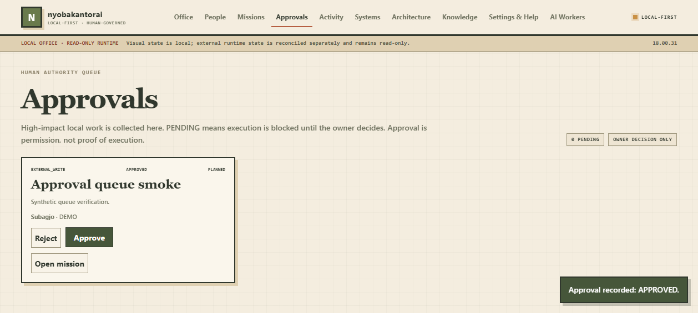

# nyobakantorai

**A local-first, human-governed multi-agent office that treats evidence as a first-class feature.**

nyobakantorai is an experimental visual workspace for coordinating AI-agent roles without pretending that a configured model, a moving avatar, or a task label proves work actually happened.

The core idea is simple:

```text
human intent
    ↓
scoped task
    ↓
agent role / runtime
    ↓
work product
    ↓
evidence + provenance
    ↓
independent verification
```

The default build is intentionally conservative: localhost-only, no autonomous dispatch endpoint, no bundled credentials, no production-write capability, and no hidden provider calls.


## Highlights

- **6 example agent personas** — coordination, metrics, engineering, strategy, creative, and independent QA.
- **16 reusable skills** — task truth, safe tool use, approval gates, source provenance, research, growth, engineering, creative, and QA.
- **Evidence-gated task state** — VERIFIED is not a vibe; it requires independent evidence.
- **Human approval gate** — external writes, paid actions, account changes, and destructive work cannot execute before explicit owner approval.
- **Read-only runtime adapter** — Hermes is optional and fails closed when it is unavailable or stale.
- **Manual handoff + receipt protocol** — provenance-aware cross-surface work without inventing delivery.
- **Portable diagnostics** — a local doctor checks expected safety boundaries without printing secrets.
- **Machine-readable capabilities** — other tools can inspect the office contract through `GET /api/capabilities`.
- **Public-release guardrails** — CI checks tests, build output, private-path leakage, sensitive filenames, and credential-shaped strings.
- **Zero npm runtime dependencies** for the main office server.

## Quick start

Requirements:

- Node.js 20+
- Python 3.10+
- PyYAML for Python utilities/tests

```bash
git clone https://github.com/exxrawrrr/nyobakantorai.git
cd nyobakantorai

python -m pip install -r requirements-dev.txt
npm run verify
npm start
```

Open:

```text
http://127.0.0.1:4322
```

Windows users can also run `office/START-NYOBAKANTORAI.bat`.

Hermes is **optional**. Without it, the UI stays usable in fast offline mode.

## Optional Hermes adapter

Configure only the values you actually need:

```text
NYOBAKANTORAI_HERMES_EXE=/absolute/path/to/hermes
NYOBAKANTORAI_HERMES_HOME=/absolute/path/to/.hermes
NYOBAKANTORAI_BOARD=nyobakantorai
NYOBAKANTORAI_PORT=4322
NYOBAKANTORAI_WORKER_PORT=4333
```

No secret is required by the repository itself.

## Public project layout

| Path | Purpose |
| --- | --- |
| `office/` | Visual local office, task UI, runtime cache, and read-only adapter |
| `agents/` | Six example public SOUL/profile definitions |
| `skills/hermes-custom/` | Reusable portable skills |
| `operations/taskctl/` | Blocked owner-controlled Hermes task intake |
| `operations/handoff/` | Manual handoff, receipts, and source-evidence gates |
| `operations/workflow/` | Deterministic routing preview and QA request flow |
| `operations/doctor/` | Read-only environment diagnostics |
| `packages/task-registry/` | Standalone evented task-registry prototype |
| `packages/runtime-adapter/` | Dependency-free read-only runtime adapter SDK |
| `docs/` | Architecture, approval model, threat model, privacy, demo, release checklist, and adapter contract |
| `scripts/` | Security, public-release, and test automation |

## Capability endpoint

```http
GET /api/capabilities
```

Example contract:

```json
{
  "app": "nyobakantorai",
  "api": 1,
  "runtime_adapter_api": 1,
  "local_only": true,
  "dispatch": false,
  "runtime_adapter": "none",
  "evidence_gated_verification": true,
  "human_approval_gate": true,
  "approval_risk_classes": ["EXTERNAL_WRITE", "PAID_ACTION", "ACCOUNT_CHANGE", "DESTRUCTIVE"]
}
```

This endpoint is discovery metadata, not authorization.

### Human approval in the UI

High-impact missions remain pending until the owner explicitly approves them. The browser UI reflects that state and the registry enforces it.



## Safety model

nyobakantorai is designed around **least privilege and honest state**.

- Skills are procedures, not permissions.
- A configured provider is not proof that inference happened.
- A task card is not an execution receipt.
- A named reviewer is not proof that an independent review happened.
- External writes require explicit scoped human approval.
- Runtime claims that cannot be reconciled degrade to UNKNOWN / NOT CONNECTED.
- The office server binds to localhost and rejects cross-site mutation attempts.
- Credentials, runtime databases, logs, private paths, and personal workspace artifacts are excluded from the public release.

Run the full release gate before every push:

```bash
npm run verify
```

## Development

```bash
npm run audit
npm test
npm run demo
npm run demo:adapter
npm run build
npm start
```

`npm run demo` executes a deterministic synthetic multi-agent flow without contacting a model or external service. `npm run demo:adapter` prints a bounded read-only Runtime Adapter SDK snapshot.

The CI workflow runs the same verification on Linux and Windows.

## Project status

**v0.2 public-preview**

The current focus is the adapter boundary, portable agent/skill definitions, signed or independently verifiable execution receipts, and stronger capability negotiation.

See:

- `office/docs/ARCHITECTURE.md`
- `docs/RUNTIME-ADAPTER-SPEC.md`
- `docs/APPROVAL-MODEL.md`
- `docs/DEMO.md`
- `docs/RELEASE-CHECKLIST.md`
- `docs/PUBLICATION-RUNBOOK.md`
- `docs/THREAT-MODEL.md`
- `docs/PRIVACY.md`
- `SECURITY.md`
- `CONTRIBUTING.md`
- `ROADMAP.md`

MIT licensed.
